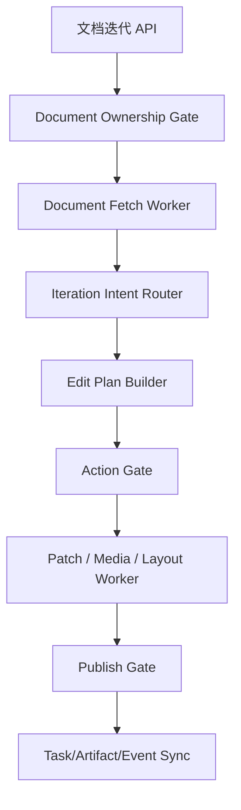
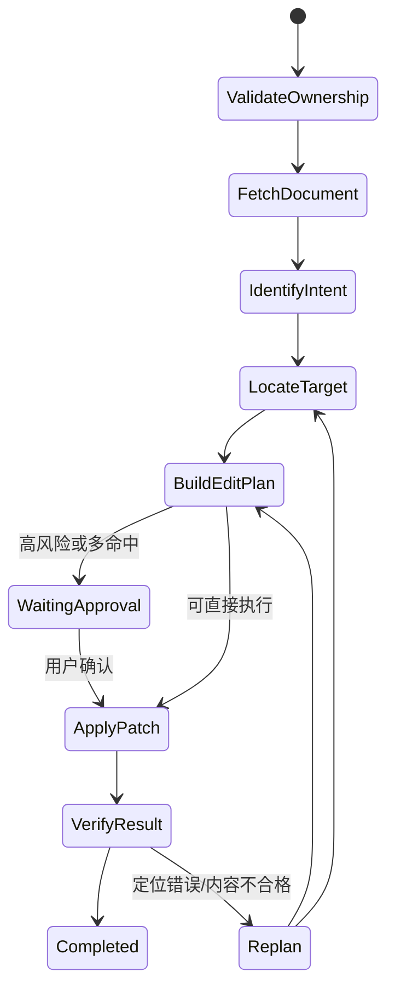

# 文档迭代实现方案

## 1. 背景与目标

当前项目已经具备场景 C 的“生成飞书文档”能力，但还不具备“基于已生成文档继续迭代”的正式链路。现有能力只覆盖：

1. 生成文档正文。
2. 写入飞书文档。
3. 返回文档链接。

这还不够支撑产品要求中的“围绕需求自动生成并迭代核心文档或白板内容”，更不满足进阶需求中的：

1. 用户引用已有文档并提出修改要求。
2. 系统识别修改意图是新增、修改、删除还是阐述。
3. 系统在文档内进行精确修改，而不是整篇重写。
4. 系统支持样式优化、布局调整、图片/表格等富媒体插入。

因此，本次目标不是“补一个 update 接口”，而是补齐一套正式的 `Document Iteration` 能力：

1. 只允许迭代本系统曾生成并登记过的飞书文档。
2. 支持文档读取、结构定位、局部修改、解释说明、富媒体插入。
3. 把用户自然语言编辑需求转成受控的结构化编辑计划。
4. 复用现有 planner/harness/skills，不引入第二套平行执行体系。

## 2. 设计原则

沿用 `im_harness架构设计.md` 的主原则，并对文档迭代场景补充以下约束：

1. 文档迭代是 `场景 C 的能力扩展`，不是新的野生脚本入口。
2. 编辑行为必须先结构化，再落工具，不允许直接把用户原话拼成 CLI 参数。
3. “读文档”“定位修改点”“生成修改内容”“写回飞书”必须分层，不把所有逻辑塞进一个 service。
4. 对文档的所有副作用都要可审计、可回放、可拒绝。
5. “解释 explain” 是只读能力，不应混入写入链路。
6. 富媒体和布局调整必须抽象成统一操作模型，不能为图片、表格、白板各写一套分散流程。

## 3. 当前代码现状与缺口

### 3.1 现有能力

当前已有：

1. `LarkDocTool.createDoc(...)`
2. `LarkDocTool.appendMarkdown(...)`
3. `LarkDocTool.updateDoc(...)`
4. `DocumentWorkflowNodes.writeDocAndSync(...)`
5. `ArtifactRepository.findByTaskId(...)`

这说明系统能“写出一篇文档”，但不能“对一篇已生成文档做可靠迭代”。

### 3.2 关键缺口

当前至少有六个结构性缺口：

1. **缺少文档归属校验**
   当前 `ArtifactRepository` 只能按 `taskId` 查，不能按 `docUrl/docId` 反查。
   这意味着后端无法证明“用户传入的文档 URL 是否为本系统生成”。

2. **缺少文档结构读取能力**
   目前 `LarkDocTool` 没有 `fetchDoc`，无法读取文档内容、block id、标题结构。

3. **缺少块级修改能力抽象**
   当前只有粗粒度 `append/update`，没有“定位哪一段、哪一块、哪一节”的统一模型。

4. **缺少编辑意图模型**
   insert/update/delete/explain、样式优化、布局调整、媒体插入都还只是自然语言，没有统一枚举和执行策略。

5. **缺少受控编辑计划**
   如果直接让 LLM 输出最终文档内容或直接决定 CLI 调用，风险太高，也无法审计。

6. **缺少文档迭代入口 API**
   当前 `PlannerController` 只有 plan / command / resume / runtime，没有文档迭代接口。

## 4. 总体架构

文档迭代仍然放在现有六层架构中，落点如下：

1. 交互入口层：新增 `文档迭代 API`
2. 会话与任务中枢层：登记 `DocumentIterationTask`
3. Planner / Orchestrator 层：新增 `DocumentIterationIntentRouter + EditPlanBuilder`
4. 能力执行层：新增 `DocumentFetchToolWorker + DocumentPatchToolWorker + DocumentMediaToolWorker`
5. 门禁层：新增 `DocumentOwnershipGate + EditActionGate + PublishGate`
6. 状态同步层：沿用现有 Task/Step/Event/Artifact 广播

推荐链路：



## 5. 功能边界

### 5.1 本次必须支持

1. `explain`
   解释当前文档某一段、某一节、某个图表在说什么，不写回飞书。

2. `insert`
   在指定位置新增内容，如新增一节、新增一段、新增行动项、新增图表说明。

3. `update`
   修改已有内容，包括：
   - 内容改写
   - 语气/风格调整
   - 结构优化
   - 标题重写
   - 术语统一

4. `delete`
   删除某段、某节、某块或某个冗余元素。

5. `style_adjust`
   调整样式和表达，不改变主事实，例如：
   - 面向发布会风格
   - 面向管理层汇报风格
   - 更口语化 / 更正式 / 更简洁

6. `media_insert`
   插入图片、文件、表格、白板/图表引用。

7. `layout_adjust`
   对文档块顺序、标题层级、callout、列表、引用块做布局整理。

### 5.2 本次不做

1. 任意第三方飞书文档编辑
2. 多人并发协同编辑冲突自动合并
3. 完整所见即所得编辑器
4. 所有飞书 XML block 类型的全覆盖

## 6. 核心模型设计

### 6.1 新增意图枚举

建议新增：

`DocumentIterationIntentType`

1. `EXPLAIN`
2. `INSERT`
3. `UPDATE_CONTENT`
4. `UPDATE_STYLE`
5. `DELETE`
6. `INSERT_MEDIA`
7. `ADJUST_LAYOUT`

不要把所有事情都塞进一个 `UPDATE`。  
因为：

1. explain 是只读
2. media/layout 是不同工具路径
3. content/style 的生成 prompt、验证规则、落地命令都不一样

### 6.2 目标定位模型

新增 `DocumentTargetSelector`

字段建议：

1. `docId`
2. `docUrl`
3. `targetType`
   - `TITLE`
   - `SECTION`
   - `PARAGRAPH`
   - `BLOCK`
   - `RANGE`
   - `IMAGE`
   - `TABLE`
4. `locatorStrategy`
   - `BY_HEADING`
   - `BY_EXACT_TEXT`
   - `BY_BLOCK_ID`
   - `BY_SECTION_RANGE`
   - `BY_KEYWORD`
5. `locatorValue`
6. `matchedBlockIds`
7. `matchedExcerpt`

### 6.3 编辑计划模型

新增 `DocumentEditPlan`

字段建议：

1. `taskId`
2. `intentType`
3. `selector`
4. `reasoningSummary`
5. `generatedContent`
6. `styleProfile`
7. `mediaSpec`
8. `layoutSpec`
9. `toolCommandType`
10. `requiresApproval`
11. `riskLevel`

### 6.4 原子操作模型

新增 `DocumentPatchOperation`

字段建议：

1. `operationType`
   - `STR_REPLACE`
   - `BLOCK_INSERT_AFTER`
   - `BLOCK_REPLACE`
   - `BLOCK_DELETE`
   - `BLOCK_MOVE_AFTER`
   - `APPEND`
   - `OVERWRITE`
   - `MEDIA_INSERT`
2. `blockId`
3. `startBlockId`
4. `endBlockId`
5. `oldText`
6. `newContent`
7. `docFormat`
8. `justification`

这里本质上是一个 `Command Pattern`：

1. planner 负责生成 `DocumentPatchOperation`
2. tool worker 只负责执行命令
3. gate 负责审计命令是否合法

## 7. 归属校验：只能迭代已生成文档

这是本次最重要的系统约束。

### 7.1 必须做成后端能力，而不是前端约定

当用户传入文档 URL 时，后端必须：

1. 解析出 `docId/docToken`
2. 在本地持久化记录中反查该文档是否由本系统生成
3. 若找不到归属记录，直接拒绝执行写操作

### 7.2 仓储改造建议

当前：

1. `ArtifactRepository.save`
2. `ArtifactRepository.findByTaskId`

建议扩展为：

1. `findByExternalUrl(String externalUrl)`
2. `findByDocumentId(String docId)`
3. `findLatestDocArtifactByTaskId(String taskId)`

同时在 `Artifact` 或新增 `DocumentOwnershipRecord` 中补充：

1. `docId`
2. `docUrl`
3. `ownerTaskId`
4. `ownerScenario`
5. `createdBySystem`
6. `lastEditedBy`
7. `lastEditedAt`

### 7.3 为什么不只靠 URL 规则

因为：

1. 飞书 URL 只能证明“这是一个飞书文档”
2. 不能证明“这是本系统生成的文档”
3. 不能证明“这个文档还在本次任务允许编辑的范围内”

## 8. 文档读取与定位

### 8.1 必须从 Markdown 思维切到结构化文档思维

文档迭代不能继续只用 Markdown 字符串替换。  
必须引入：

1. 文档全文读取
2. outline 读取
3. section/range/block 级读取
4. 带 block id 的结构化视图

### 8.2 `LarkDocTool` 必须扩展

建议新增以下能力：

1. `fetchOutline(docUrl)`
2. `fetchSection(docUrl, blockId)`
3. `fetchFull(docUrl, detail=with-ids/full)`
4. `updateByCommand(docUrl, command, content, blockId...)`
5. `insertMedia(docUrl, mediaSpec)`

底层对应飞书 CLI：

1. `docs +fetch --scope outline`
2. `docs +fetch --scope section/range`
3. `docs +update --command str_replace`
4. `docs +update --command block_insert_after`
5. `docs +update --command block_replace`
6. `docs +update --command block_delete`
7. `docs +media-insert`

### 8.3 定位策略

优先级建议：

1. `BY_HEADING`
   最适合“把项目背景这一节改一下”

2. `BY_EXACT_TEXT`
   最适合“把这段具体文本改掉”

3. `BY_BLOCK_ID`
   最稳定，适合二次连续编辑

4. `BY_KEYWORD`
   作为兜底，不宜直接写回，最好先确认唯一命中

定位规则：

1. 唯一命中可直接执行
2. 多命中进入澄清
3. 零命中尝试 section -> range -> keyword 逐级回退

## 9. 意图识别设计

### 9.1 两阶段识别

文档迭代意图识别建议采用：

1. `Hard Rule First`
2. `LLM Classification Fallback`

### 9.2 第一阶段：规则优先

示例：

1. 包含“解释一下 / 是什么意思 / 阐述一下” -> `EXPLAIN`
2. 包含“新增一段 / 加一节 / 插入” -> `INSERT`
3. 包含“修改 / 改写 / 润色 / 调整成发布会风格” -> `UPDATE_CONTENT` 或 `UPDATE_STYLE`
4. 包含“删掉 / 删除 / 去掉” -> `DELETE`
5. 包含“插入图片 / 插入表格 / 上传附件 / 加白板” -> `INSERT_MEDIA`
6. 包含“调整结构 / 调整布局 / 改成 callout / 调整标题层级” -> `ADJUST_LAYOUT`

### 9.3 第二阶段：LLM 兜底

规则无法命中时，让 LLM 只能从上述枚举中选一个。  
和前面 `IntentRouter` 的改法保持一致：

1. 给出固定枚举
2. 限制只能返回一个枚举值
3. 不允许自由生成新意图

## 10. 执行编排设计

### 10.1 不建议新开平行系统

文档迭代仍然走 harness，只是新增一个 `DocumentIterationExecutionService`。

建议拆分为：

1. `DocumentOwnershipGuard`
2. `DocumentFetchService`
3. `DocumentIterationIntentService`
4. `DocumentTargetLocator`
5. `DocumentEditPlanService`
6. `DocumentPatchExecutor`
7. `DocumentIterationGuard`

### 10.2 推荐执行状态机



### 10.3 explain 的特殊路径

`EXPLAIN` 不进入 `ApplyPatch`，只走：

1. 归属校验
2. 文档读取
3. 目标定位
4. 解释生成
5. 返回 explanation artifact

## 11. 富媒体与布局调整设计

### 11.1 不要混在普通 update 里

建议单独能力：

1. `MediaInsertionWorker`
2. `LayoutAdjustmentWorker`

原因：

1. 图片/文件插入依赖上传与资源 token
2. 表格/白板插入依赖不同工具或 XML block
3. 布局调整依赖 block 级移动、replace、容器块变换

### 11.2 统一抽象

新增：

`RichContentSpec`

字段建议：

1. `mediaType`
   - `IMAGE`
   - `TABLE`
   - `WHITEBOARD`
   - `FILE`
2. `sourceType`
   - `UPLOAD`
   - `EXISTING_URL`
   - `GENERATED`
3. `placement`
4. `caption`
5. `renderStyle`

### 11.3 布局调整抽象

新增：

`LayoutAdjustmentSpec`

字段建议：

1. `targetBlockId`
2. `action`
   - `MOVE`
   - `WRAP_AS_CALLOUT`
   - `CONVERT_TO_LIST`
   - `PROMOTE_HEADING`
   - `DEMOTE_HEADING`
3. `referenceBlockId`
4. `styleHints`

## 12. API 设计建议

### 12.1 新增接口

建议新增独立接口，而不是复用 `resume` 或 `plan command`：

`POST /planner/tasks/document-iteration`

请求体建议：

```json
{
  "taskId": "optional-existing-task-id",
  "docUrl": "https://jcneyh7qlo8i.feishu.cn/docx/xxx",
  "instruction": "帮我把项目背景这一部分改成面向发布会的语言风格",
  "workspaceContext": {
    "profession": "产品经理",
    "industry": "智能办公"
  }
}
```

### 12.2 响应

同步返回：

1. `taskId`
2. `planningPhase`
3. `recognizedIntent`
4. `requireInput`
5. `preview`

如果直接执行成功，还应返回：

1. `docUrl`
2. `modifiedBlocks`
3. `summary`

### 12.3 explain 接口是否独立

不建议单独开 explain API。  
因为 explain 与 insert/update/delete 共享：

1. 文档归属校验
2. 文档读取
3. 目标定位
4. 任务状态投影

只需在统一接口中通过 `recognizedIntent` 分支处理。

## 13. 推荐的类设计

### 13.1 app/controller 层

新增：

1. `DocumentIterationRequest`
2. `DocumentIterationController` 或在 `PlannerController` 中新增 endpoint

更推荐独立 controller：

1. `PlannerController` 负责任务规划
2. `DocumentIterationController` 负责文档迭代

这样边界更清晰。

### 13.2 common 层

新增：

1. `DocumentIterationIntentType`
2. `DocumentTargetSelector`
3. `DocumentEditPlan`
4. `DocumentPatchOperation`
5. `RichContentSpec`
6. `LayoutAdjustmentSpec`
7. `DocumentOwnershipRecord` 或扩展 `Artifact`

### 13.3 skills 层

扩展 `LarkDocTool`：

1. `fetchDocOutline`
2. `fetchDocSection`
3. `fetchDocFull`
4. `updateByCommand`
5. `insertMedia`

### 13.4 harness 层

新增模块：

1. `harness/document/iteration/service`
2. `harness/document/iteration/model`
3. `harness/document/iteration/support`
4. `harness/document/iteration/config`

核心 service：

1. `DefaultDocumentIterationExecutionService`
2. `DocumentIterationWorkflowNodes`
3. `DocumentOwnershipGuard`
4. `DocumentTargetLocator`
5. `DocumentEditPlanBuilder`
6. `DocumentPatchExecutor`

## 14. 风险与门禁

### 14.1 Ownership Gate

拒绝：

1. URL 不存在
2. URL 不是飞书 doc
3. URL 不在系统 artifact/ownership 记录中

### 14.2 Action Gate

必须人工确认的场景：

1. 删除整个章节
2. overwrite 全文
3. 多命中定位
4. 布局调整影响多个 block

### 14.3 Verify Gate

写回后要做结果校验：

1. 目标段落是否真的被替换
2. 文档结构是否仍然合法
3. explain 操作是否没有产生副作用

## 15. 分阶段落地建议

### Phase 1：最小可用闭环

支持：

1. ownership 校验
2. 文档 fetch
3. explain
4. update content
5. delete

底层优先支持：

1. `BY_HEADING`
2. `BY_EXACT_TEXT`
3. `str_replace`
4. `block_replace`
5. `block_delete`

### Phase 2：增强编辑

支持：

1. insert
2. style_adjust
3. layout_adjust
4. explain + update 联动

### Phase 3：富媒体与复杂布局

支持：

1. image/file insert
2. table block insert
3. whiteboard reference insert
4. 多块移动与组合布局

## 16. 结论

这次功能如果只是“前端传 URL，后端调用一下 update”，最后一定会再次长成屎山。  
因为真正困难的不是调用飞书 CLI，而是：

1. 如何证明这篇文档可以被系统编辑
2. 如何把自然语言编辑需求稳定地映射到结构化目标
3. 如何把编辑行为抽象成统一命令模型
4. 如何扩展到 explain / style / media / layout 而不把代码炸碎

因此，本方案的核心判断是：

1. 文档迭代必须是 `场景 C` 的正式能力，不是脚本补丁。
2. 必须把“归属校验、结构读取、目标定位、编辑计划、命令执行、结果校验”拆成独立层。
3. `Strategy + Command + Guard` 是这次最合适的组合。
4. 先做“可精确编辑已生成文档”，再扩展富媒体和布局，不要一开始就把所有写操作塞进一个 `updateDoc`。

如果按这个方案实现，后续无论是“改成发布会风格”“插入一张图”“把风险章节挪到前面”“解释某一段含义”，都能在同一套架构里扩展，而不需要每来一个需求就重写一条临时链路。
