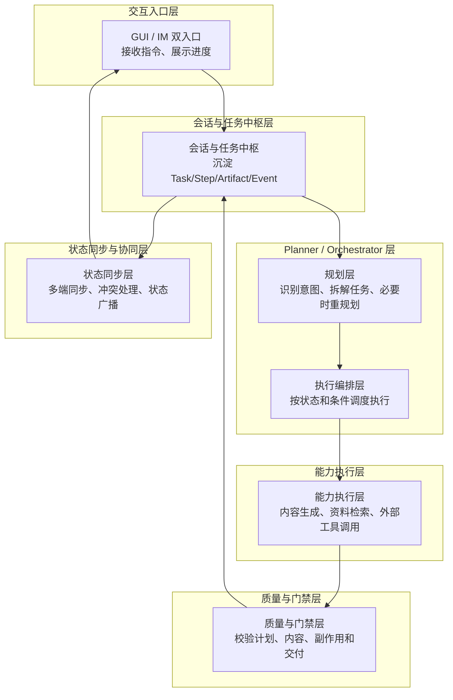
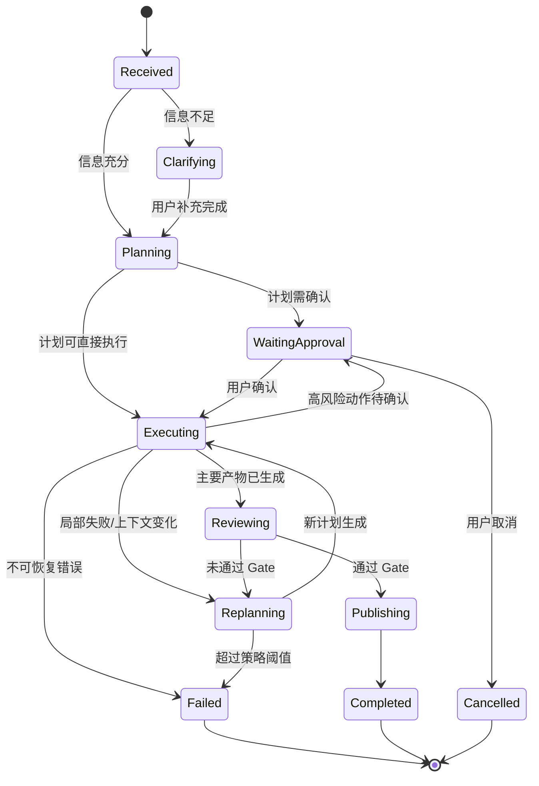
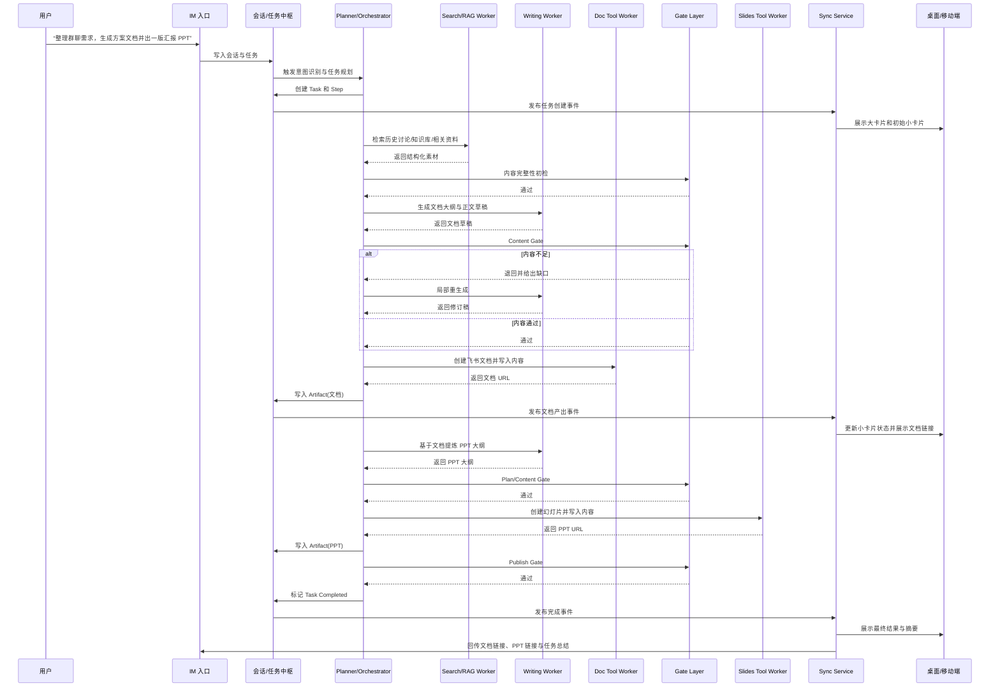

# IM Harness 架构设计

## 1. 目标与设计原则

本文面向目标产品《基于 IM 的办公协同智能助手》，给出一版适合该产品的 Harness 架构设计。目标不是搭一个“固定顺序串行跑子 Agent”的流水线，而是搭一个能支撑 IM、Doc、PPT/白板、多端同步、动态重规划、质量门禁和持续可视化的 Agent 执行系统。

设计原则如下：

1. AI 是主驾驶，GUI 是仪表盘和辅助操作台。
2. 系统的核心不是“某个大模型多聪明”，而是任务状态、编排规则、工具能力、质量门禁和同步机制是否完备。
3. 编排必须支持动态规划与局部回退，不能依赖固定顺序。
4. 能工具化的尽量工具化，不把所有能力都人格化成 Agent。
5. 前端展示的大卡片和小卡片，本质上是后端任务状态的投影，不应由某个 Agent 临时生成。
6. 多端同步是主架构的一部分，不是执行链路的附属能力。

## 2. 为什么不采用“supervisor -> harness 主节点 -> 固定顺序子节点 -> 统一评审”的方案

这类方案不适合本产品，主要有六个问题：

1. `supervisor` 与 `harness 主节点` 职责重叠，都会演化成第二个总控脑，边界很快混乱。
2. 固定顺序不符合产品要求。题目明确要求场景可独立成立、可自由组合编排，不限定固定触发顺序与链路形态。
3. 大卡片和小卡片不该是临时“生成物”，而应来自统一任务模型。
4. 统一评审后整轮重跑过重，不适合办公协同中的局部修正和人机协作。
5. 上下文整理压缩不应成为固定主链路节点，而应作为通用服务按需触发。
6. 多端一致性如果不单列为架构层，会导致移动端和桌面端任务状态漂移。

因此，本产品更适合：

`事件驱动的任务状态机 + 可重规划的编排器 + 能力型工作节点 + 分层质量门禁 + 独立多端同步层`

## 3. 总体架构

系统分为六层：

1. 交互入口层
2. 会话与任务中枢层
3. Planner / Orchestrator 层
4. 能力执行层
5. 质量与门禁层
6. 状态同步与协同层

### 3.1 总体架构图

这张图只保留六层骨架和主要流向，目的是先让人一眼看懂：

1. 用户输入先进入任务中枢。
2. 规划层负责理解和拆解任务。
3. 执行层负责调度 worker 和 tool。
4. 门禁层负责在关键节点做校验和回退。
5. 任务中枢沉淀状态，再同步到各端。

更细的 worker、tool、状态模型和执行路径，放在后续小节展开，不挤在总图里。

## 4. 六层详细说明

### 4.1 交互入口层

职责：

1. 接收用户文本、语音和 GUI 操作。
2. 把所有输入归档到统一会话体系。
3. 允许用户从任意端启动任务、追问进度、修改目标或确认关键操作。

注意：

1. 入口层不直接承载复杂业务逻辑。
2. 不在入口层拼接散乱状态，所有状态以任务中枢为准。

### 4.2 会话与任务中枢层

这是系统单一真相源。所有前端展示、Agent 调度、结果回传都以这里为准。

核心实体：

1. `Conversation`：一次 IM 对话或多轮任务相关对话。
2. `Task`：用户的一次大目标，对应前端大卡片。
3. `Step`：任务下的执行步骤，对应前端小卡片。
4. `Artifact`：中间或最终产物，如纪要、文档大纲、飞书文档链接、PPT 链接、白板链接。
5. `Approval`：人工确认、拒绝、补充说明。
6. `Event`：状态变化事件，如开始执行、生成草稿、待确认、失败、重试、完成。

### 4.3 Planner / Orchestrator 层

这是整个系统唯一的“大脑层”，不再额外拆一个 supervisor 和一个 harness 主节点。

内部职责划分：

1. `Intent Router`
   - 判断用户是在发起新任务、继续旧任务、查询进度、补充材料、修正文档还是要生成 PPT。
2. `Task Planner`
   - 将用户目标拆解为任务图或状态机，而不是写死一条固定流水线。
3. `Execution Orchestrator`
   - 依据当前计划和运行时结果调度 worker/tool。
4. `Replanner`
   - 在失败、内容不足、用户插话或新上下文出现时，局部重规划。
5. `Context / Memory Compression`
   - 按需做摘要、裁剪、聚合，不强制每轮都走。

关键原则：

1. 编排对象是“步骤图”，不是“固定子 Agent 队列”。
2. 重试优先做局部回退，不做整轮从头再跑。
3. 优先先澄清，再生成；优先先验证，再落盘。

### 4.4 能力执行层

该层分成两类能力。

第一类是 LLM Worker，负责理解、规划、生成。

1. `Summary Worker`
2. `Writing Worker`
3. `Slide Outline Worker`
4. `Search / RAG Worker`

第二类是 Tool Worker，负责操作外部系统。

1. `Feishu Doc Tool Worker`
2. `Feishu Slides Tool Worker`
3. `Whiteboard Tool Worker`
4. `IM Tool Worker`
5. `Drive / File Tool Worker`

这里的设计重点是：

1. 能工具化的不要人格化。
2. 外部系统操作必须有显式输入、显式输出和显式错误事件。
3. Worker 输出的是结构化结果和状态，不是模糊聊天消息。

### 4.5 质量与门禁层

不设置一个统一“评审节点”对全任务抽象打分，而是分阶段设 gate。

主要 gate：

1. `Plan Gate`
   - 检查任务拆解是否完整、是否需要用户确认目标或边界。
2. `Content Gate`
   - 检查生成内容的结构、完整性、事实支撑、格式规范。
3. `Action Gate`
   - 检查是否允许真正写入飞书文档、创建白板、发送 IM 消息、覆盖已有内容。
4. `Publish Gate`
   - 检查最终是否满足交付要求，是否可以把链接和摘要正式回传给用户。

失败后的处理策略：

1. `step retry`：单步骤重试。
2. `local replan`：局部重规划。
3. `human clarification`：请求用户澄清。
4. `fallback output`：保留已成功产物，返回降级结果。

### 4.6 状态同步与协同层

该层是多端产品的关键，不应被隐藏在 Agent 内部。

职责：

1. 实时推送任务状态、步骤状态、产物变化。
2. 保证桌面端、移动端、IM 回执看到的是同一任务事实。
3. 支持用户中途修改任务后的冲突检测与合并。
4. 处理离线编辑和恢复后的同步。

建议机制：

1. 事件流驱动前端刷新，而不是前端主动轮询拼状态。
2. 对文档类和任务类状态分别维护版本号。
3. 对用户编辑与 Agent 编辑做来源标记，便于冲突处理。

## 5. 前端卡片模型设计

前端的大卡片和小卡片不应由 AI 临时“生成”，而应由统一数据模型映射得到。

### 5.1 大卡片

对应 `Task`，建议字段：

1. `taskId`
2. `title`
3. `goal`
4. `status`
5. `currentStage`
6. `progress`
7. `owner`
8. `createdAt`
9. `updatedAt`
10. `artifacts`
11. `riskFlags`
12. `needUserAction`

### 5.2 小卡片

对应 `Step`，建议字段：

1. `stepId`
2. `taskId`
3. `type`
4. `name`
5. `status`
6. `inputSummary`
7. `outputSummary`
8. `retryCount`
9. `assignedWorker`
10. `startedAt`
11. `endedAt`

### 5.3 结果物

对应 `Artifact`，建议字段：

1. `artifactId`
2. `taskId`
3. `type`
4. `title`
5. `url`
6. `version`
7. `sourceStepId`
8. `preview`
9. `status`

### 5.4 映射关系

1. 大卡片 = `Task`
2. 小卡片 = `Step`
3. 可点击预览和最终链接 = `Artifact`
4. 状态变更动画、进度条和时间轴 = `Event`

## 6. 推荐的任务状态机

状态机特征：

1. 支持澄清。
2. 支持执行中二次确认。
3. 支持局部重规划。
4. 支持失败后的可恢复和不可恢复分流。

## 7. 一条标准执行链路

下面给出一条从 IM 到文档再到 PPT 的标准执行链路。这是一条常见链路，不是唯一链路。

### 7.1 时序图

## 8. 不同任务类型下的编排差异

同一个 Harness，不应只支持一条主路径。

### 8.1 IM 纪要型

路径：

`IM -> Summary Worker -> Content Gate -> Doc Tool -> Publish`

特点：

1. 不一定需要 Search。
2. 不一定需要 PPT。

### 8.2 已有文档转 PPT 型

路径：

`Doc URL -> Planner -> Slide Outline Worker -> Slides Tool -> Publish`

特点：

1. 可以绕过文档生成。
2. 重点是结构提炼和版式生成。

### 8.3 白板共创型

路径：

`IM -> Planner -> Whiteboard Tool -> 用户协作修订 -> Publish`

特点：

1. 需要更强的人机往返。
2. 更适合多次小步确认，不适合长链条黑箱执行。

## 9. 重试、回退与人工确认策略

### 9.1 不推荐的做法

不推荐：

1. 统一打分后整轮重跑。
2. 最多 3 次后取最高分版本直接给用户。

这会带来：

1. 成本高。
2. 用户不可理解。
3. 产物不可控。
4. 局部错误被放大为整轮返工。

### 9.2 推荐的做法

推荐策略：

1. 失败优先定位到 step。
2. 能局部重做就局部重做。
3. 高风险动作前必须人工确认。
4. 产物部分可用时优先返回部分结果。

可配置的回退策略示例：

1. 搜索结果不足：重搜一次，仍不足则请求补充关键词或资料。
2. 文档结构不完整：只重做大纲和缺失章节。
3. PPT 创建失败：保留文档成果，提示稍后重试 PPT。
4. 用户中途修改目标：将未完成步骤标记为 `superseded`，触发重规划。

## 10. 为什么这是更适合本产品的 Harness

该架构比“固定顺序多 Agent 流水线”更适合本产品，原因如下：

1. 符合题目要求的“模块化场景”和“自由组合编排”。
2. 能天然支撑 IM、Doc、PPT/白板这些异构能力协同。
3. 能把多端同步提升为一等公民，而不是附属功能。
4. 能把前端卡片、进度、状态流转与后端真实执行状态打通。
5. 更符合办公协同的局部修正、持续可见、人机混合决策模式。

## 11. 一句话定义

最适合该产品的 IM Harness 架构可以定义为：

**一个以任务状态机为骨架、以事件流为血液、以 Planner/Orchestrator 为大脑、以工具能力节点为手脚、以分层 Gate 为护栏、以多端同步层为外显界面的 Agent 执行系统。**
