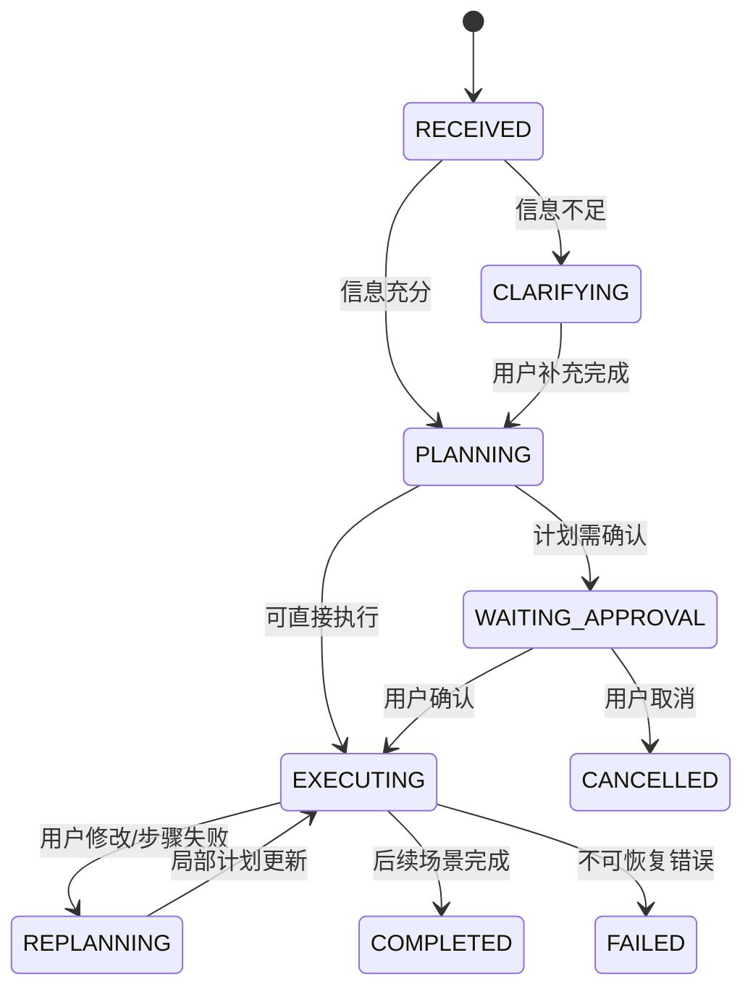
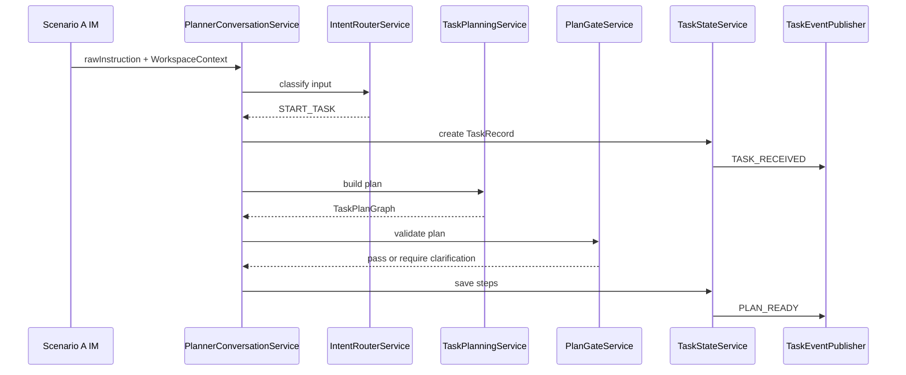
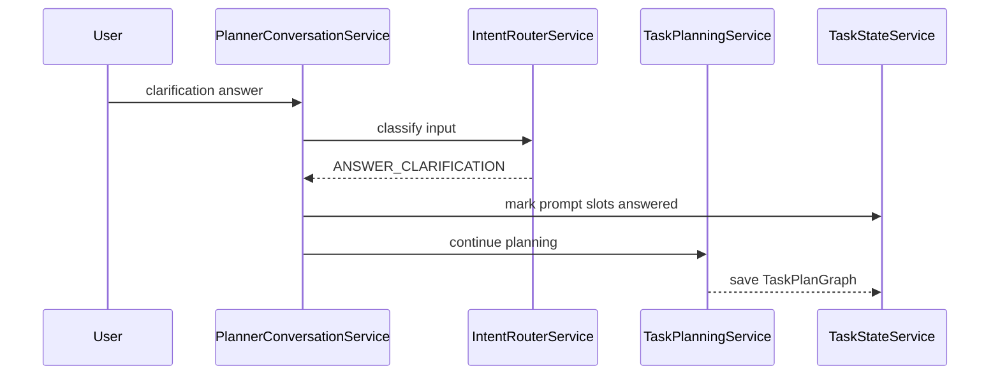
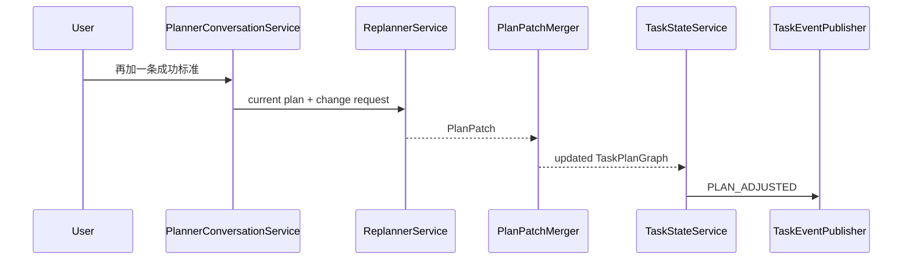

# 场景 B：任务理解与规划开发文档

> 开发 planner 与 IM 交互前，请先阅读补充规则：[Planner 与 IM 交互开发规则](planner-im-development-rules.md)。该文档沉淀了意图识别、UNKNOWN 回复、计划修改、IM 文案、产物通知、失败重试和真实测试的约束。下一阶段演进建议见：[Planner 下一阶段优化建议](planner-next-optimizations.md)。

## 1. 定位

场景 B 是从自然语言输入到可执行任务图的核心层，对应最终 Harness 架构中的 `Planner / Orchestrator` 层，并承接 `会话与任务中枢层` 的一部分状态建模。

在最终架构中，场景 B 不只是生成一段计划文本，而是负责：

1. 判断用户输入类型。
2. 维护任务会话上下文。
3. 生成结构化任务计划图。
4. 将计划图落成可执行 Step。
5. 在用户补充、失败、内容不足时局部重规划。
6. 对外发布标准化任务事件，供 IM、GUI、Doc、PPT、白板和同步层消费。

一句话定义：

场景 B 是把用户目标转换成可追踪、可执行、可重规划任务状态机的系统中枢。

## 2. 当前代码现状

当前已经具备的能力：

1. IM 输入可以通过 `PlannerConversationService` 进入 planner。
2. `TaskSessionResolver` 可以基于 `chatId + threadId` 续接已有会话。
3. `TaskIntakeService` 可以粗分新任务、澄清回复、状态查询、计划调整。
4. `SupervisorPlannerService` 已经具备澄清、意图识别、计划生成、计划增量调整能力。
5. `PlanTaskSession` 可以保存计划阶段、意图快照、计划蓝图、卡片和上下文。
6. `PlannerStateStore` 已有 session 和 event 存储接口。

当前主要缺口：

1. `PlanTaskSession` 同时承担 Conversation、Task、Plan、Runtime 状态，职责过重。
2. `PlanBlueprint` 仍是计划草案，不是可执行任务图。
3. `UserPlanCard` 更像展示卡片，不是完整 Step Runtime。
4. `SupervisorPlannerService` 承担过多职责，后续接 Doc/PPT/白板时会继续膨胀。
5. 缺少独立 Orchestrator，无法根据 Step 状态自动调度能力节点。
6. 缺少 Plan Gate、Action Gate 等分层门禁。
7. 事件还偏内部日志，没有成为多端同步和前端卡片的统一事实源。

## 3. 改造目标

场景 B 的目标不是一次性实现完整六层 Harness，而是先把 planner 改造成后续 C/D/E/F 可以直接接入的任务运行时核心。

第一阶段完成后应具备：

1. 用户从 IM 发起任务后，系统生成 `TaskRecord` 和 `TaskStepRecord`。
2. 前端大卡片来自 `TaskRecord`，小卡片来自 `TaskStepRecord`。
3. `PlanBlueprint` 可以转换为 `TaskPlanGraph`。
4. 每个 Step 有明确状态、输入、输出、worker 类型、重试次数。
5. 用户说“再加一条”“改成 PPT”“先做文档”时，系统生成 `PlanPatch` 或局部更新 Step。
6. 后续 Doc/PPT/白板模块只需要注册 worker，不需要改 IM 入口和 planner 主流程。

## 4. 模块边界

建议把场景 B 拆成以下服务。

### 4.1 Conversation Intake

推荐类：

1. `PlannerConversationService`
2. `TaskSessionResolver`
3. `IntentRouterService`

职责：

1. 接收 A 场景传入的 IM/GUI 输入。
2. 解析 conversation key。
3. 判断输入是新任务、补充信息、修改计划、查询状态、确认操作还是取消任务。
4. 输出标准化 `TaskCommand`。

不负责：

1. 不直接生成计划。
2. 不直接调用 Doc/PPT 工具。
3. 不直接修改 Step 执行状态。

### 4.2 Task Planning

推荐类：

1. `TaskPlanningService`
2. `IntentUnderstandingService`
3. `ClarificationService`
4. `PlanGraphBuilder`

职责：

1. 从用户目标中抽取意图、交付物、约束、缺失信息。
2. 信息不足时生成澄清问题。
3. 信息充分时生成 `PlanBlueprint`。
4. 将 `PlanBlueprint` 转换成 `TaskPlanGraph`。

输出：

1. `IntentSnapshot`
2. `PlanBlueprint`
3. `TaskPlanGraph`
4. `RequireInput`

### 4.3 Orchestration Runtime

推荐类：

1. `ExecutionOrchestrator`
2. `TaskStateService`
3. `StepDispatchService`
4. `WorkerRegistry`

职责：

1. 根据 Task 和 Step 状态决定下一步。
2. 调度具体 worker。
3. 处理 step retry。
4. 写入 Step 输出和 Artifact。
5. 发布事件。

第一版可以只支持 `executeNext(taskId)`，不需要直接做复杂 DAG 调度。

### 4.4 Replanning

推荐类：

1. `PlanAdjustmentService`
2. `ReplannerService`
3. `PlanPatchMerger`

职责：

1. 处理用户对已有计划的修改。
2. 处理 Step 失败后的局部重规划。
3. 处理新上下文出现后的计划更新。
4. 输出 `PlanPatch` 或更新后的 `TaskPlanGraph`。

规则：

1. 默认局部更新。
2. 只有用户明确要求重做，才整包替换计划。
3. 已完成 Artifact 默认保留。
4. 被新计划替代的 Step 标记为 `SUPERSEDED`。

### 4.5 Gate

推荐类：

1. `PlanGateService`
2. `ActionGateService`
3. `ContentGateService`
4. `PublishGateService`

第一阶段必须实现：

1. `PlanGateService`
2. `ActionGateService`

第一阶段可以延后：

1. `ContentGateService`
2. `PublishGateService`

## 5. 核心模型

### 5.1 TaskCommand

用于表达用户输入后的标准命令。

```java
public class TaskCommand {
    private String commandId;
    private TaskCommandType type;
    private String taskId;
    private String conversationKey;
    private String rawText;
    private WorkspaceContext workspaceContext;
    private String idempotencyKey;
}
```

建议枚举：

```java
public enum TaskCommandType {
    START_TASK,
    ANSWER_CLARIFICATION,
    ADJUST_PLAN,
    QUERY_STATUS,
    CONFIRM_ACTION,
    CANCEL_TASK
}
```

### 5.2 TaskRecord

对应前端大卡片。

```java
public class TaskRecord {
    private String taskId;
    private String conversationKey;
    private String title;
    private String goal;
    private TaskStatus status;
    private String currentStage;
    private int progress;
    private List<String> artifactIds;
    private List<String> riskFlags;
    private boolean needUserAction;
    private int version;
}
```

建议状态：

```java
public enum TaskStatus {
    RECEIVED,
    CLARIFYING,
    PLANNING,
    WAITING_APPROVAL,
    EXECUTING,
    REPLANNING,
    REVIEWING,
    PUBLISHING,
    COMPLETED,
    FAILED,
    CANCELLED
}
```

### 5.3 TaskStepRecord

对应前端小卡片，也是 Orchestrator 的调度对象。

```java
public class TaskStepRecord {
    private String stepId;
    private String taskId;
    private StepType type;
    private String name;
    private StepStatus status;
    private String inputSummary;
    private String outputSummary;
    private String assignedWorker;
    private List<String> dependsOn;
    private int retryCount;
    private int version;
}
```

建议状态：

```java
public enum StepStatus {
    PENDING,
    READY,
    RUNNING,
    WAITING_APPROVAL,
    COMPLETED,
    FAILED,
    SKIPPED,
    SUPERSEDED
}
```

建议 Step 类型：

```java
public enum StepType {
    INTENT_UNDERSTANDING,
    CLARIFICATION,
    PLAN_GENERATION,
    DOC_DRAFT,
    DOC_CREATE,
    PPT_OUTLINE,
    PPT_CREATE,
    WHITEBOARD_CREATE,
    IM_REPLY,
    ARCHIVE
}
```

### 5.4 TaskPlanGraph

`PlanBlueprint` 的执行态版本。

```java
public class TaskPlanGraph {
    private String taskId;
    private String goal;
    private List<TaskStepRecord> steps;
    private List<String> deliverables;
    private List<String> successCriteria;
    private List<String> risks;
}
```

### 5.5 ArtifactRecord

用于承接 C/D/F 场景产物。

```java
public class ArtifactRecord {
    private String artifactId;
    private String taskId;
    private String sourceStepId;
    private ArtifactType type;
    private String title;
    private String url;
    private String preview;
    private String status;
    private int version;
}
```

建议类型：

```java
public enum ArtifactType {
    DOC,
    PPT,
    WHITEBOARD,
    FILE,
    SUMMARY
}
```

### 5.6 TaskEventRecord

所有状态变化都应写事件。

```java
public class TaskEventRecord {
    private String eventId;
    private String taskId;
    private String stepId;
    private String artifactId;
    private TaskEventType type;
    private String payloadJson;
    private int version;
    private Instant createdAt;
}
```

## 6. 状态机

场景 B 需要负责推动任务状态机的前半段，并为执行态留接口。



第一阶段实现边界：

1. `RECEIVED`
2. `CLARIFYING`
3. `PLANNING`
4. `WAITING_APPROVAL`
5. `EXECUTING`
6. `REPLANNING`

`COMPLETED` 和 `FAILED` 可以先由后续 worker 或测试桩触发。

## 7. 关键流程

### 7.1 新任务规划



### 7.2 澄清回复



### 7.3 计划增量修改



## 8. 与当前类的映射

| 最终架构角色 | 当前类 | 改造建议 |
| --- | --- | --- |
| Conversation Intake | `PlannerConversationService` | 保留入口职责，输出 `TaskCommand` |
| Intent Router | `TaskIntakeService` | 升级为 `IntentRouterService`，支持确认、取消、补充素材 |
| Session Resolver | `TaskSessionResolver` | 保留，改为绑定 `ConversationSession -> TaskRecord` |
| Planning Service | `SupervisorPlannerService.plan` | 拆为 `TaskPlanningService` |
| Clarification | `SupervisorPlannerService.handleAskUser` | 拆为 `ClarificationService` |
| Plan Adjustment | `SupervisorPlannerService.adjustPlan` | 拆为 `PlanAdjustmentService` 或 `ReplannerService` |
| Plan Quality | `PlanQualityService` | 拆出 `PlanGraphBuilder` 和 `PlanPatchMerger` |
| State Store | `PlannerStateStore` | 扩展 `Task/Step/Artifact/Event` 存取 |
| Plan Card | `UserPlanCard` | 映射到 `TaskStepRecord` |

## 9. 推荐包结构

```text
im-collab-ai-assistant-planner
└── src/main/java/com/lark/imcollab/planner
    ├── intake
    │   ├── PlannerConversationService.java
    │   ├── IntentRouterService.java
    │   └── TaskCommandFactory.java
    ├── planning
    │   ├── TaskPlanningService.java
    │   ├── IntentUnderstandingService.java
    │   ├── ClarificationService.java
    │   └── PlanGraphBuilder.java
    ├── runtime
    │   ├── ExecutionOrchestrator.java
    │   ├── TaskStateService.java
    │   ├── StepDispatchService.java
    │   └── WorkerRegistry.java
    ├── replan
    │   ├── ReplannerService.java
    │   ├── PlanAdjustmentService.java
    │   └── PlanPatchMerger.java
    └── gate
        ├── PlanGateService.java
        └── ActionGateService.java
```

公共模型建议放在：

```text
im-collab-ai-assistant-common
└── src/main/java/com/lark/imcollab/common/model
    ├── command
    ├── task
    ├── step
    ├── artifact
    └── event
```

## 10. Store 接口扩展

当前 `PlannerStateStore` 应扩展为任务运行时存储。

建议新增接口：

```java
public interface TaskRuntimeStore {
    void saveTask(TaskRecord task);
    Optional<TaskRecord> findTask(String taskId);

    void saveStep(TaskStepRecord step);
    List<TaskStepRecord> findStepsByTaskId(String taskId);
    Optional<TaskStepRecord> findStep(String stepId);

    void saveArtifact(ArtifactRecord artifact);
    List<ArtifactRecord> findArtifactsByTaskId(String taskId);

    void appendEvent(TaskEventRecord event);
    List<TaskEventRecord> findEventsByTaskId(String taskId, int afterVersion);

    void bindConversationTask(String conversationKey, String taskId);
    Optional<String> findTaskIdByConversation(String conversationKey);
}
```

迁移策略：

1. 第一阶段保留 `PlannerStateStore`。
2. 新增 `TaskRuntimeStore`，由内存实现和 Redis 实现分别支持。
3. `PlanTaskSession` 继续兼容旧接口，但新增流程优先读写 `TaskRecord` 和 `TaskStepRecord`。

## 11. Worker 接入契约

场景 B 不直接实现 Doc/PPT/白板，但必须定义接入契约。

```java
public interface TaskWorker {
    boolean supports(TaskStepRecord step);
    StepExecutionResult execute(TaskExecutionContext context);
}
```

```java
public class StepExecutionResult {
    private String stepId;
    private StepStatus status;
    private String outputSummary;
    private List<ArtifactRecord> artifacts;
    private String errorCode;
    private String errorMessage;
}
```

第一批 worker：

1. `DocDraftWorker`
2. `DocCreateWorker`
3. `PptOutlineWorker`
4. `PptCreateWorker`
5. `ImReplyWorker`

## 12. Gate 策略

### 12.1 Plan Gate

检查项：

1. 是否有明确目标。
2. 是否有至少一个交付物。
3. 是否有可执行 Step。
4. 是否有成功标准。
5. 高风险动作是否设置人工确认。

输出：

1. `PASS`
2. `ASK_USER`
3. `REJECT`

### 12.2 Action Gate

检查项：

1. 是否要写入飞书文档。
2. 是否要覆盖已有内容。
3. 是否要发送 IM。
4. 是否要创建 PPT/白板。

规则：

1. 只读或草稿生成可自动执行。
2. 对外发布、覆盖、发送给他人前需要确认。
3. 可配置白名单场景自动通过。

## 13. 事件设计

建议事件类型：

```java
public enum TaskEventType {
    TASK_RECEIVED,
    CLARIFICATION_REQUESTED,
    CLARIFICATION_ANSWERED,
    INTENT_READY,
    PLAN_READY,
    PLAN_ADJUSTED,
    PLAN_APPROVAL_REQUIRED,
    PLAN_APPROVED,
    STEP_READY,
    STEP_STARTED,
    STEP_COMPLETED,
    STEP_FAILED,
    STEP_RETRY_SCHEDULED,
    ARTIFACT_CREATED,
    TASK_COMPLETED,
    TASK_FAILED,
    TASK_CANCELLED
}
```

事件使用原则：

1. 所有 Task/Step/Artifact 状态变化必须产生事件。
2. IM 自动回复和前端 SSE 都消费事件，不直接依赖 service 内部返回值。
3. 事件 payload 必须结构化，不能只放自然语言文本。

## 14. API 契约

### 14.1 创建或继续任务

```http
POST /api/planner/tasks
```

请求：

```json
{
  "rawInstruction": "整理这周 AI 协同助手项目进展，输出给老板看的汇报材料",
  "taskId": null,
  "workspaceContext": {
    "inputSource": "LARK_PRIVATE_CHAT",
    "chatId": "oc_xxx",
    "threadId": "thread_xxx",
    "messageId": "om_xxx"
  }
}
```

响应：

```json
{
  "taskId": "task-001",
  "status": "PLANNING",
  "needUserAction": false
}
```

### 14.2 获取任务详情

```http
GET /api/planner/tasks/{taskId}
```

返回：

```json
{
  "task": {},
  "steps": [],
  "artifacts": [],
  "events": []
}
```

### 14.3 确认计划

```http
POST /api/planner/tasks/{taskId}/approval
```

请求：

```json
{
  "approved": true,
  "comment": "按这个计划执行"
}
```

### 14.4 执行下一步

```http
POST /api/planner/tasks/{taskId}/execute-next
```

第一阶段可以先作为内部接口，不暴露给用户。

## 15. 开发里程碑

### M1：模型和存储

目标：

1. 新增 `TaskRecord`、`TaskStepRecord`、`ArtifactRecord`、`TaskEventRecord`。
2. 新增 `TaskRuntimeStore`。
3. 新增内存实现和 Redis 实现。
4. 保留 `PlanTaskSession` 兼容旧流程。

验收：

1. 创建任务后可查到 Task。
2. 计划生成后可查到 Steps。
3. 状态变化可查到 Events。

### M2：PlanBlueprint 到 TaskPlanGraph

目标：

1. 新增 `TaskPlanGraph`。
2. 新增 `PlanGraphBuilder`。
3. 将 `PlanBlueprint.planCards` 转换成 `TaskStepRecord`。

验收：

1. DOC 计划生成一个 DOC Step。
2. DOC + PPT 计划生成多个 Step，并保留依赖关系。
3. 前端卡片不再直接依赖 LLM 文本。

### M3：Intent Router 和 Command 化

目标：

1. 新增 `TaskCommand`。
2. 将 `TaskIntakeDecision` 升级为 `TaskCommand`。
3. 支持 `START_TASK`、`ANSWER_CLARIFICATION`、`ADJUST_PLAN`、`QUERY_STATUS`。

验收：

1. 新任务不误判为计划修改。
2. “再加一条成功标准”进入 `ADJUST_PLAN`。
3. “现在进度怎么样”进入 `QUERY_STATUS`。

### M4：Orchestrator 最小闭环

目标：

1. 新增 `ExecutionOrchestrator.executeNext(taskId)`。
2. 新增 `WorkerRegistry`。
3. 先接一个测试 worker 或 `DocDraftWorker`。

验收：

1. `READY` Step 可以进入 `RUNNING`。
2. worker 成功后 Step 进入 `COMPLETED`。
3. worker 失败后 Step 进入 `FAILED` 或 `RETRY_SCHEDULED`。

### M5：Gate 和 Approval

目标：

1. 新增 `PlanGateService`。
2. 新增 `ActionGateService`。
3. 支持计划确认和高风险动作确认。

验收：

1. 信息不足会进入 `CLARIFYING`。
2. 需要确认的任务进入 `WAITING_APPROVAL`。
3. 用户确认后进入 `EXECUTING`。

## 16. 测试要求

### 单元测试

必须覆盖：

1. `IntentRouterService` 输入分类。
2. `PlanGraphBuilder` 计划图转换。
3. `PlanPatchMerger` 增量修改。
4. `PlanGateService` 缺字段判断。
5. `ExecutionOrchestrator` Step 状态推进。

### 集成测试

必须覆盖：

1. IM 输入到 Task 创建。
2. 澄清问题生成和回复恢复。
3. 计划生成后落 Step。
4. 计划增量修改后保留原 Step。
5. Worker 执行后生成 Artifact。

### 真实场景测试

输入：

```text
帮我整理这周 AI 协同助手项目进展，输出给老板看的汇报材料
```

预期：

1. 创建一个 `TaskRecord`。
2. 生成至少一个 `DOC_DRAFT` 或 `DOC_CREATE` Step。
3. 生成成功标准和风险。
4. 发布 `TASK_RECEIVED`、`INTENT_READY`、`PLAN_READY` 事件。

追加输入：

```text
成功标准再加一条，获取进展中老板的要求来作为标准
```

预期：

1. 命令类型为 `ADJUST_PLAN`。
2. 原任务目标不变。
3. 原 Step 不被删除。
4. 成功标准追加一条。
5. 发布 `PLAN_ADJUSTED` 事件。

## 17. 不做事项

第一阶段不做：

1. 完整 GUI。
2. 完整 PPT 生成。
3. 完整白板协作。
4. 复杂 DAG 并发调度。
5. 跨端离线冲突合并。
6. 多 worker 自动资源调度。

原因：

场景 B 的优先目标是把任务状态、计划图、Step、事件、局部重规划稳定下来。只要这些契约稳定，后续 C/D/E/F 可以按模块接入。

## 18. 最小完成定义

场景 B 第一版完成的标准：

1. A 场景输入可以创建或续接 Task。
2. B 场景可以生成结构化 TaskPlanGraph。
3. PlanGraph 可以落成 TaskStepRecord。
4. 用户补充和计划修改不会覆盖原计划。
5. Task、Step、Artifact、Event 可以被统一查询。
6. 下一阶段 worker 可以只按 Step 契约接入。

达到以上标准后，场景 B 就可以作为最终 Harness 架构的核心骨架继续演进。
